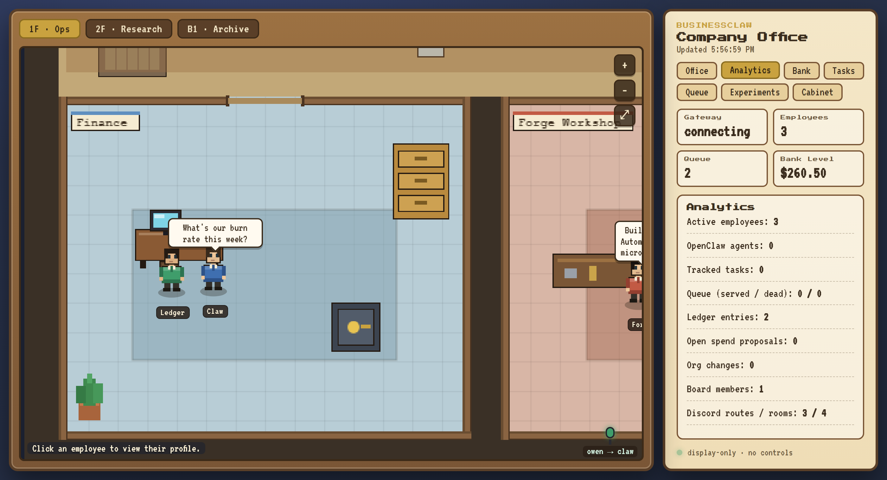
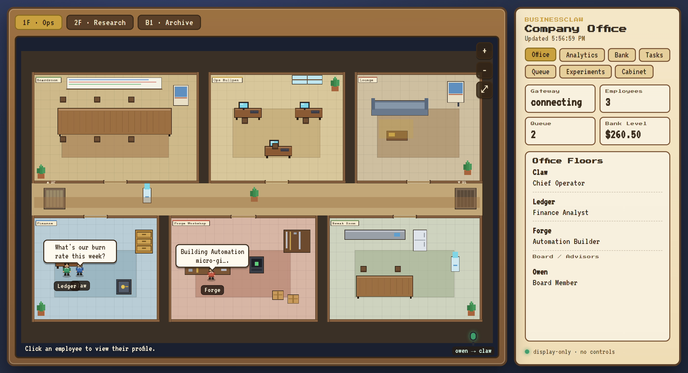
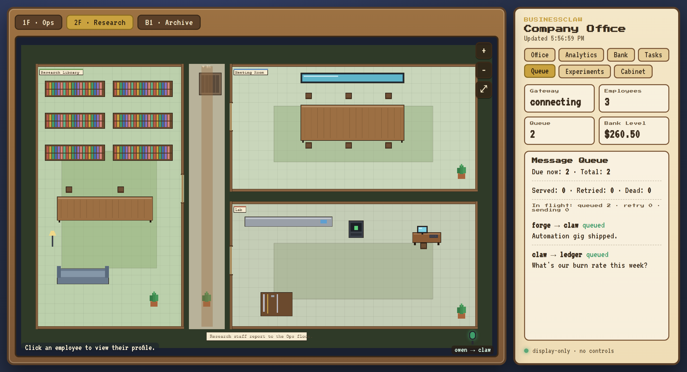
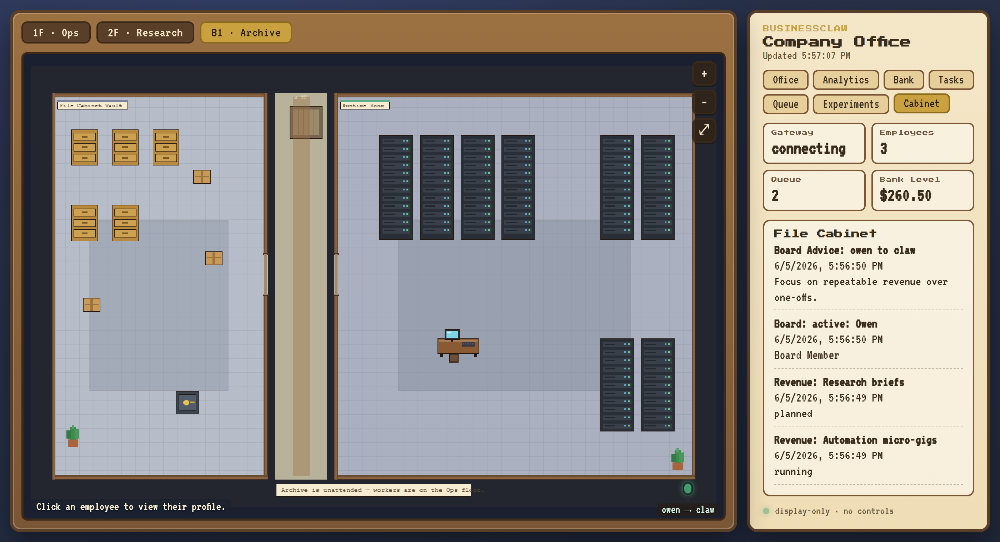

# BusinessClaw

BusinessClaw is an experimental autonomous AI business built around OpenClaw. The long-term idea is a persistent AI-run company that can chat through Discord, coordinate AI employees, create and use tools, report what it is doing through a pixel-art office dashboard, and pursue revenue-generating work while staying legal and protecting its own infrastructure.

This repository is now an OpenClaw-first project. OpenClaw should own the agent runtime, Gateway, channels, memory, tasks, model providers, tools, skills, and multi-agent routing. BusinessClaw should provide the company identity, employee structure, business rules, wallet/ledger skills, and future dashboard.

Local setup is for development only. The finished system is intended to run on a separate VPS.

## The Pixel Office Dashboard

A display-only website renders the whole company as a Stardew-Valley-style pixel
office. There are **no inputs or controls** — it is pure observation. The office
is a full building interior of varied-size rooms (boardroom, ops bullpen, lounge,
finance, forge workshop, break room, research library, lab, server room, file
vault) connected by hallways with real **doorways**. You can **scroll to zoom and
drag to pan** around the world. Each AI employee is an animated pixel character
at their desk, and when the message queue holds a conversation between two of
them, the speaker **walks through the doorways** to the other and the speech
bubble is **held until they arrive** (mirroring the durable message queue). A
side panel rotates through display views — Office roster, Analytics, current Bank
level, Tasks, Message Queue, Revenue Experiments, and the File Cabinet — and a
board "mic" lights up when the owner (board) leaves advice. Each employee wears a
name tag, and clicking one opens a **pop-out profile card** (role, current tasks,
queue activity, employment file) anchored right over the office.



*Claw has walked over to Ledger in Finance to deliver a queued message; the board
mic shows the owner advising Claw; Analytics and the live bank level are on the
right.*

Three switchable floors:

<table>
  <tr>
    <td></td>
    <td></td>
    <td></td>
  </tr>
  <tr>
    <td align="center"><b>1F · Ops</b> — board, ops, finance, forge</td>
    <td align="center"><b>2F · Research</b> — library + meeting room</td>
    <td align="center"><b>B1 · Archive</b> — file cabinet + runtime room</td>
  </tr>
</table>

The dashboard reads live state from OpenClaw plus the BusinessClaw skill data
(org, ledger, wallet, board, Discord routing, revenue, queue). It is decoupled
from the gateway via a cached refresh, so it always loads instantly even if the
gateway is slow. See [docs/DASHBOARD.md](docs/DASHBOARD.md) for details.

## Download & Run It Yourself

Prerequisites: **Node.js 22+** and (for the agent runtime) **OpenClaw**.

```bash
# 1. Get the code
git clone <your-businessclaw-repo-url> businessclaw
cd businessclaw

# 2. Run the display-only dashboard (no agent runtime required)
cd dashboard
npm install
npm start
# open http://127.0.0.1:4177
```

The dashboard runs on its own and shows the company's current structure (it falls
back to sensible defaults when no data exists yet). To run the full autonomous
business behind it:

```powershell
# Windows: install OpenClaw, configure the workspace, agents, and skills
iwr -useb https://openclaw.ai/install.ps1 | iex
.\scripts\setup-businessclaw-openclaw.ps1
.\scripts\verify-businessclaw.ps1        # readiness check
.\scripts\start-dashboard.ps1            # serve the dashboard
```

For a dedicated server, `scripts/bootstrap-vps.sh` followed by
`scripts/install-vps-services.sh` installs OpenClaw, the agents, the queue
worker, and the dashboard as systemd services behind a Caddy reverse proxy.
See [docs/VPS_CHECKLIST.md](docs/VPS_CHECKLIST.md).

## Current Direction

- Run continuously as a service.
- Use OpenClaw model providers for hosted or local LLMs.
- Interact with owners through OpenClaw Discord/channel routing.
- Support multiple Discord owners and employee-specific conversations.
- Use OpenClaw memory, task ledger, sessions, standing orders, and skills.
- Spawn AI employees that run side by side with the main agent.
- Track each employee's daily and weekly work.
- Let owners change employee reporting style and ask employees to work on demand.
- Maintain employee memory and relationship notes so the company feels interactive.
- Display company state on a website as a pixel-art office scene.
- Let the business use money it earns, while protecting wallets, credentials, and infrastructure.

## Non-Goals

- No hidden or stealth behavior.
- No bypassing platform rules, rate limits, account limits, KYC, captchas, or access controls.
- No spending owner-provided money.
- No direct custody of important funds during early development.
- No pretending to be human in places where bot identity matters.

## Recommended Architecture

BusinessClaw should be built as a small service stack:

- **OpenClaw Gateway**: Owns agent runtime, channels, tasks, sessions, memory, tools, skills, and model providers.
- **OpenClaw Discord channel**: Primary company chat interface.
- **OpenClaw agents**: BusinessClaw employees such as Claw, Ledger, and Forge.
- **BusinessClaw skills/plugins**: Wallet, earned-capital ledger, revenue experiments, dashboard export.
- **Web dashboard**: Pixel-art office showing agent and employee state through the OpenClaw App SDK.
- **Reverse proxy**: Caddy or Nginx for HTTPS on the deployed server.

## First Milestones

1. Install OpenClaw and verify Gateway/dashboard locally.
2. Move `openclaw-workspace/main/` into the OpenClaw main workspace.
3. Configure Discord through OpenClaw instead of the prototype bot.
4. Configure OpenClaw agents for Claw, Ledger, and Forge.
5. Install/use the BusinessClaw ledger skill.
6. Build wallet and revenue experiment skills/plugins.
7. Build the pixel-art dashboard against the OpenClaw App SDK.
8. Deploy OpenClaw Gateway to Oracle Cloud or a VPS.

## Local Quick Start

OpenClaw is not installed in this shell yet. Install OpenClaw first:

```powershell
iwr -useb https://openclaw.ai/install.ps1 | iex
openclaw onboard --install-daemon
openclaw gateway status
openclaw dashboard
```

See [docs/OPENCLAW_PIVOT.md](docs/OPENCLAW_PIVOT.md) for the transfer plan.

Useful docs:

- [docs/ARCHITECTURE.md](docs/ARCHITECTURE.md)
- [docs/MIGRATION_CHECKLIST.md](docs/MIGRATION_CHECKLIST.md)
- [docs/DISCORD_SETUP.md](docs/DISCORD_SETUP.md)
- [docs/DISCORD_ROUTING.md](docs/DISCORD_ROUTING.md)
- [docs/BOARD_MODEL.md](docs/BOARD_MODEL.md)
- [docs/MODEL_SETUP.md](docs/MODEL_SETUP.md)
- [docs/DASHBOARD.md](docs/DASHBOARD.md)
- [docs/AUTONOMY.md](docs/AUTONOMY.md)
- [docs/PERMISSIONS.md](docs/PERMISSIONS.md)
- [docs/WALLET_SETUP.md](docs/WALLET_SETUP.md)
- [docs/COST_CONTROL.md](docs/COST_CONTROL.md)
- [docs/DEPLOYMENT_OPENCLAW.md](docs/DEPLOYMENT_OPENCLAW.md)
- [docs/VPS_CHECKLIST.md](docs/VPS_CHECKLIST.md)

Current local URLs:

- OpenClaw Gateway/dashboard: `http://127.0.0.1:18789/`
- BusinessClaw display-only pixel dashboard: `http://127.0.0.1:4177/`

## Deployment Opinion

Oracle Cloud Always Free is a strong candidate for this because the Ampere A1 allocation is generous for an API-driven agent service. It is less ideal if you want zero friction, predictable provisioning, or easy support. A cheap paid VPS is usually simpler and more predictable, but it will have much less RAM at the $5/month level.

The practical recommendation:

- Use local development first.
- Try Oracle Cloud Always Free for production if you can get an Ampere A1 instance in your region.
- Keep a $5-6/month VPS as the fallback if Oracle provisioning is annoying or reliability becomes the priority.

## Safety Model

The project should feel like an autonomous AI business, but the owner should always be able to inspect, pause, and override it. The core rule is not "ask permission for everything"; the core rule is "stay legal, stay observable, and do not compromise yourself."

See [docs/SAFETY_RULES.md](docs/SAFETY_RULES.md) for the operating rules.
