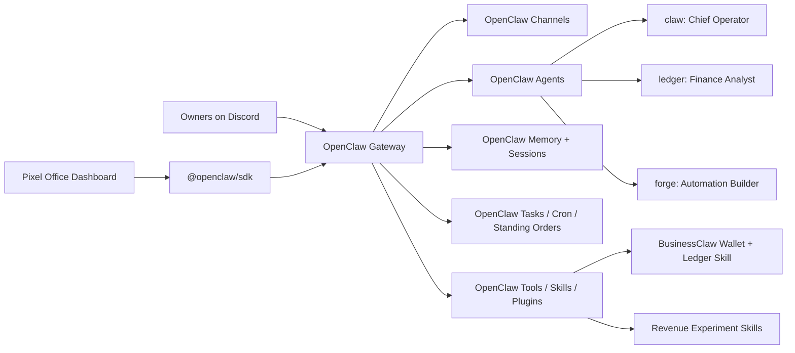

# Architecture

BusinessClaw is now designed as an OpenClaw-based autonomous AI business.

## System Overview



## Platform Roles

### OpenClaw

OpenClaw owns:

- Gateway process.
- Discord and other chat channels.
- Access groups, routing, and bot-loop protection.
- Agent runtime.
- Model providers and failover.
- Agent sessions and memory.
- Background tasks, cron, hooks, standing orders, and Task Flow.
- Skills, plugins, tools, approvals, and policy.
- App SDK for external dashboards and scripts.

### BusinessClaw

BusinessClaw owns:

- Company identity and operating instructions.
- AI employee roles.
- Business standing orders.
- Wallet and earned-capital policy.
- Custom skills/plugins for business operations.
- Pixel-art dashboard.
- Deployment profile for Oracle Cloud or a VPS.

## Workspace Layout

This repo stores OpenClaw workspace material under:

```text
openclaw-workspace/
  main/
    AGENTS.md
    SOUL.md
    TOOLS.md
    MEMORY.md
    standing-orders.md
  agents/
    ledger/
      AGENTS.md
    forge/
      AGENTS.md
  skills/
    businessclaw-ledger/
      SKILL.md
```

These files should be copied or synced into the real OpenClaw workspace after OpenClaw is installed and onboarded.

## Employees

Start with three OpenClaw agents:

- `claw`: Chief Operator.
- `ledger`: Finance Analyst.
- `forge`: Automation Builder.

Each employee should have its own workspace and `agentDir` when configured in OpenClaw multi-agent mode. This keeps auth, sessions, and memory separated.

## Dashboard

The dashboard should not run the agent. It should use `@openclaw/sdk` to inspect and visualize:

- agents
- sessions
- runs
- task ledger
- tools
- approvals
- artifacts
- events

The pixel office can render employees at desks, meetings, finance board, active tasks, revenue stats, and alerts from OpenClaw Gateway state.

## Prototype Runtime

The Python `businessclaw/` package is now prototype/reference code only. It may be useful for ideas, but should not become the production agent brain.

